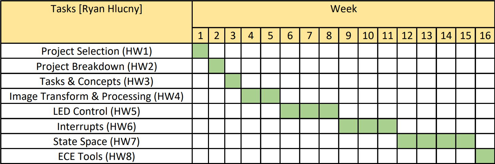

# HW03 - Tasks & Concepts

## Ryan Hlucny

### Overview

- [Project Role](#project-role)
- [Tasks](#tasks)
- [Gantt Chart](#gantt-chart)
- [ECE Concepts](#ece-concepts)
- [ECE Tools](#ece-tools)

---

### Project Role

My role on the project is the Software and Controls lead. I will be overseeing the design of the software and controls for the project.

---

### Tasks

#### Task 1 - Image Transform & Processing

- Image pre-processing
- Pixel Transformation
- Brightness compensation
- Lag Compensation (to prevent "swirl" effect)
- ECE Concept: Image processing, Matlab

#### Task 2 - LED Control

- LED driver routine
- High-speed SPI communications
- ECE Concept: Embedded LED control

#### Task 3 - Interrupts

- Updating the LED command
- Reading sensor values
- ECE Concept: Embedded MCU Interrupts

#### Task 4 - State Space Model and Observer

- State Space model of system
- Observer design
- Angle estimation
- Latency Compensation?
- ECE Concept: Modern Control State Space modeling and Observing

---

### Gantt Chart

---

### ECE Concepts

As listed in each of the above Tasks, my concepts are

- Concept 1 - Image Processing, Matlab
- Concept 2 - Embedded LED Control
- Concept 3 - Embedded MCU Interrupts
- Concept 4 - Modern Control State Space modeling and Observing

---

### ECE Tools

**Oscilloscope** - Measuring signal timing and signal characteristics. Debugging SPI communication channel between [Raspberry Pi Pico W](https://www.raspberrypi.com/documentation/microcontrollers/raspberry-pi-pico.html) and custom LED board utilizing [Adafruit DotStar (SK9822) Addressable RGB LEDs](https://www.adafruit.com/product/2343), and I2C Communications to [IMU sensor](https://www.sparkfun.com/products/15335).

**Development Environments** - I will be using [VS Code](https://code.visualstudio.com/) and the [Platform.io extension](https://platformio.org/) to develop the embedded code for the [Raspberry Pi Pico W](https://www.raspberrypi.com/documentation/microcontrollers/raspberry-pi-pico.html) in C++. I am running an [arduino-pico core](https://arduino-pico.readthedocs.io/en/latest/index.html), which ports the RP2040 mcu to the Arduino ecosystem, from [earlephilhower](https://github.com/earlephilhower/arduino-pico). The documentation for arduino-pico can be found [here](https://arduino-pico.readthedocs.io/en/latest/index.html).
