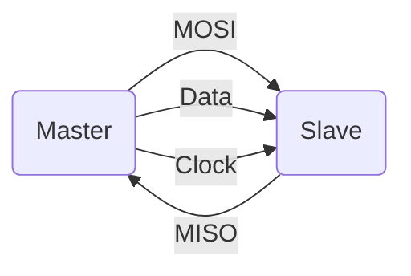
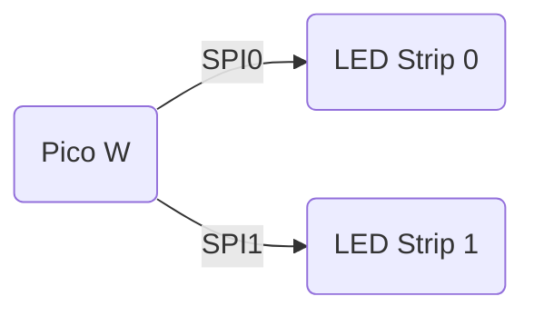

# HW05 - Task 2 - LED Control

## Ryan Hlucny

### Task Overview

My second task includes controlling the LEDs. The Dotstar LED from Adafruit can be found [here](https://www.adafruit.com/product/2328#technical-details). The actual chip inside the "Dotstar" LED is the [SK9822](https://cdn-shop.adafruit.com/product-files/2343/SK9822_SHIJI.pdf).

The data sheet provides the data frame required to control the SK9822 using the [SPI](https://en.wikipedia.org/wiki/Serial_Peripheral_Interface) protocol. SPI stands for Serial Peripheral Interface, which is a simple communication protocol that includes a master and (multiple) slave device(s). The following diagram shows a basic overview.



`MOSI`: Master Out Slave In

`MISO`: Master In Slave Out

`Data`: Data line

`Clock`: Clock line

The Raspberry Pi Pico W has 2 dedicated hardware SPI busses. Each LED strip is going to have its own dedicated Hardware SPI bus.



### Data Structure

#### Start Frame 32 Bits

| `0000 0000` | `0000 0000` | `0000 0000` | `0000 0000` |
| :---: | :---: | :---: | :---: |
| 8-bits | 8-bits | 8-bits | 8-bits |

#### LED Frame 32 Bits

| `111` | `Global` | `BLUE` | `GREEN` | `RED` |
| :---: | :---: | :---: | :---: | :---: |
| 3-bits | 5-bits | 8-bits | 8-bits | 8-bits |

#### End Frame 32 Bits

| `1111 1111` | `1111 1111` | `1111 1111` | `1111 1111` |
| :---: | :---: | :---: | :---: |
| 8-bits | 8-bits | 8-bits | 8-bits |

### Code

The SK9822 can be driven with a serial data frequency up to 30 MHz. However, at such high frequencies, we found the data signal fidelity would deteriorate as it propogates through the LED strip. It works fine at 30 MHz for ~10 LEDs, but with a longer strip the data signal is attennuated to the point that the color becomes corrupted. For a strip of 144 LEDs, I found that around 15 MHz worked well for signal fidelity and the signal made it to the end of the strip without any noticeable deterioration.

I am going to use SPI communication techniques to communicate to the LEDs according to the above data structure.

My code for the SPI protocol is shown here below

```cpp

int hello = 1;
Bob bob = new Bob(hello);

```
