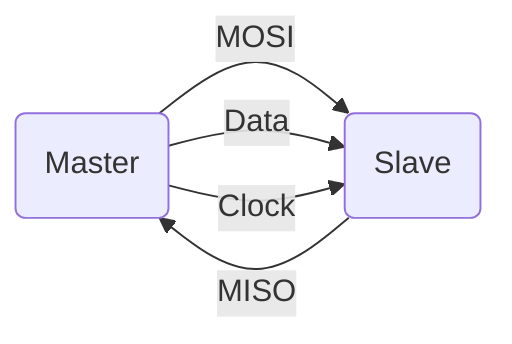
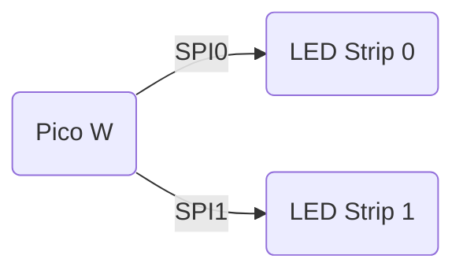

# HW05 - Task 2 - LED Control

## Ryan Hlucny

### Task Overview

My second task includes controlling the LEDs. The Dotstar LED from Adafruit can be found [here](https://www.adafruit.com/product/2328#technical-details). The actual chip inside the "Dotstar" LED is the [SK9822](https://cdn-shop.adafruit.com/product-files/2343/SK9822_SHIJI.pdf).

The data sheet provides the data frame required to control the SK9822 using the [SPI](https://en.wikipedia.org/wiki/Serial_Peripheral_Interface) protocol. SPI stands for Serial Peripheral Interface, which is a simple communication protocol that includes a master and (multiple) slave device(s). The following diagram shows a basic overview.



`MOSI`: Master Out Slave In

`MISO`: Master In Slave Out

`Data`: Data line

`Clock`: Clock line

The Raspberry Pi Pico W has 2 dedicated hardware SPI busses. Each LED strip is going to have its own dedicated Hardware SPI bus.



### Data Structure

#### Start Frame 32 Bits

| `0000 0000` | `0000 0000` | `0000 0000` | `0000 0000` |
| :---: | :---: | :---: | :---: |
| 8-bits | 8-bits | 8-bits | 8-bits |

#### LED Frame 32 Bits

| `111` | `Global` | `BLUE` | `GREEN` | `RED` |
| :---: | :---: | :---: | :---: | :---: |
| 3-bits | 5-bits | 8-bits | 8-bits | 8-bits |

#### End Frame 32 Bits

| `1111 1111` | `1111 1111` | `1111 1111` | `1111 1111` |
| :---: | :---: | :---: | :---: |
| 8-bits | 8-bits | 8-bits | 8-bits |

### Code

The SK9822 can be driven with a serial data frequency up to 30 MHz. However, at such high frequencies, we found the data signal fidelity would deteriorate as it propogates through the LED strip. It works fine at 30 MHz for ~10 LEDs, but with a longer strip the data signal is attennuated to the point that the color becomes corrupted. For a strip of 144 LEDs, I found that around 15 MHz worked well for signal fidelity and the signal made it to the end of the strip without any noticeable deterioration.

I am going to use SPI communication techniques to communicate to the LEDs according to the above data structure.

So I made a custom SPI LED library in C++. It's a simple header and implementation file, which is included in the PlatformIO -> LEDTest project in this repository. I will also include the source code at the bottom of this document.

The most important parts are the `SPI_LED::setStrip()` and `SPI_LED::write()` functions, which I will dive into now.

### `SPI_LED::setStrip()`

Every **SPI_LED** object has its own `pixelArray` allocated in memory. This array is allocated to store all the RGB values for each pixel in the strip. The number of LEDs, the color ordering (RGB, BGR, GRB, etc), a pointer to the SPI interface object to use, as well as the SPI settings to configure the SPI for communication (frequency, data order, SPI mode), are all passed into the constructor and are initialized as private fields upon creation of an **SPI_LED** object.

The `setStrip()` function takes in a new pixel array and copies the values into the **SPI_LED** object's `pixelArray` in memory. It does this by taking a pointer to the beginning of the new array and the size of that array in bytes, and then it uses the `std::copy` function built into the `std` library to copy the elements from the given array elements to the `pixelArray` pre-allocated at the creation of an **SPI_LED** object.

```c++
void SPI_LED::setStrip(uint8_t* newPixelArrayPtr, uint16_t size) {
    std::copy(newPixelArrayPtr, newPixelArrayPtr + size, this->pixelArrayPtr);
}
```

The elements must be copied to isolate the memory space of the **SPI_LED** `pixelArray` and to avoid memory corruption of the arrays.

### `SPI_LED::write()`

And finally the actual SPI communication. The code is fairly straightforward to read and is well commented, but essentially I am just following the datasheet on the protocol required to command these LEDs.

```c++
void SPI_LED::write() {
    if (!pixelArrayPtr)
        return;

    uint8_t *ptr = pixelArrayPtr, i;
    uint16_t n = numLEDs;

    spi->beginTransaction(spiSettings);

    // *** Start Frame ***
    for (i = 0; i < 4; i++)
        spi->transfer(0x00);
    
    // *** Pixel Data ***
    do {
        spi->transfer(0xFF); // Pixel start (setting global brightness frame to full)
        for (i = 0; i < 3; i++)
            spi->transfer(*ptr++); // Color Data
    } while (--n);

    // *** End Frame *** 
    // The number of bytes in the end frame is determined by the length of the strip,
    // Since its function is to allow the strip colors to propogate through the rest of the strip 
    for (i = 0; i < ((numLEDs + 15) / 16); i++)
        spi->transfer(0xFF);

    spi->endTransaction();
}
```

### Demo Code

The following code example shows how to use the library that I made, and will be followed with a video demo as well. In order to use the class, you just need to create an **SPI_LED** object with the number of LEDs, the color ordering, a pointer to the SPI interface object to use, as well as the SPI settings to configure the SPI for communication (frequency, data order, SPI mode). Since I will be using two strips and both SPI interfaces on the Pico W, I will have to create two **SPI_LED** objects.

```c++
#include <Arduino.h>
#include "SPI_LED.h"
#include <SPI.h>

#define freq 1000000


SPI_LED ledStrip0(3, BGR, &SPI, SPISettings(freq, MSBFIRST, SPI_MODE0));
// SPI_LED ledStrip1(43, BGR, &SPI1, SPISettings(freq, MSBFIRST, SPI_MODE0));
uint8_t c1[3][3] = {{0, 0, 255},{0, 255, 0},{255, 0, 0}};
uint8_t c2[3][3] = {{0, 255, 0},{0, 0, 255},{0, 255, 0}};
uint8_t c4[2][3] = {{255, 0, 0}, {0, 0, 255}};

void setup() {   
    // Set up SPI0 with the proper pin assignments
    SPI.setSCK(PIN_SPI0_SCK);
    SPI.setTX(PIN_SPI0_MOSI);
    SPI.setRX(PIN_SPI0_MISO);
    SPI.setCS(PIN_SPI0_SS);

    ledStrip0.begin();
    ledStrip0.clear();
    ledStrip0.write();
}

void loop() {
    ledStrip0.setStrip(&c1[0][0], sizeof(c1));
    ledStrip0.write();
    delay(500);
    ledStrip0.setStrip(&c2[0][0], sizeof(c2));
    ledStrip0.write();
    delay(500);
    ledStrip0.setStrip(&c4[0][0], sizeof(c4),0);
    ledStrip0.write();
    delay(500);
    ledStrip0.setStrip(&c4[0][0], sizeof(c4),1);
    ledStrip0.write();
    delay(500);
    ledStrip0.clear();
    ledStrip0.write();
    delay(500);
}
```

The library also allows you to set individual pixel colors, using the `setPixelColor` function, but I have not demonstrated that since the functionality is quite simple and I won't be using it as it would be less efficient than using the `std::copy` function and doing the whole led strip at once. Nonetheless, below is a demo using that functionality anyways.

```c++
ledStrip0.setPixelColor(0,255,0,0);
ledStrip0.setPixelColor(1,0,255,0);
ledStrip0.setPixelColor(2,0,0,255);
ledStrip0.write();
```

### Results

Here is an image of the LEDs being controlled using my SPI library.


And here is a demo video of the above code.

https://github.com/RyanHlucny/LED_POV/assets/31110301/68bab8f0-ea38-421a-89dd-69bf47463b7b

### Summary

This SPI library will be integrated into the project as a whole. It has several feature which make it particularly nice for our application. More specifically, being able to set the entire `pixelArray` all at once is going to be useful for implementing the image pixel data LUT (Look-up-table) more efficiently.

### Source Code

#### Source Code Header File "SPI_LED.h"

```c++
#pragma once

#include <Arduino.h>
#include <SPI.h>

// Color order flags. This depends on LED chips specification in its datasheet. 
#define RGB (0 | (1 << 2) | (2 << 4))
#define RBG (0 | (2 << 2) | (1 << 4))
#define GRB (1 | (0 << 2) | (2 << 4))
#define GBR (2 | (0 << 2) | (1 << 4))
#define BRG (1 | (2 << 2) | (0 << 4))
#define BGR (2 | (1 << 2) | (0 << 4))

class SPI_LED
{
    public: 
        SPI_LED(uint16_t numLEDs, uint8_t pixelType = BRG, SPIClass* spi = &SPI, SPISettings spiSettings = SPISettings(1000000, MSBFIRST, SPI_MODE0));
        void begin();
        void setPixelColor(uint16_t n, uint8_t r, uint8_t g, uint8_t b);
        void setStrip(uint8_t* newPixelArrayPtr, uint16_t size);
        void setStrip(uint8_t* newPixelArrayPtr, uint16_t size, uint16_t startPixel);
        void write();
        void clear();

    private:
        SPIClass* spi = NULL;
        SPISettings spiSettings;
        uint16_t numLEDs;
        uint32_t freq;
        uint8_t* pixelArrayPtr;
        uint8_t redOffset;
        uint8_t greenOffset;
        uint8_t blueOffset;
};
```

#### Source Code Implementation File "SPI_LED.cpp"

```c++
#include "SPI_LED.h"

/**
 * The SPI interface passed in must have the MOSI, MISO, clokc, and data lines set prior to construction of this object.
 * @param
*/

/**
 * @brief The SPI interface passed in must have the MOSI, MISO, clokc, and data lines set prior to construction of this object.
 * @param numLEDs the number of LEDs in the strip
 * @param freq the SPI clock frequency to be used
 * @param pixelType pixel color ordering
 * @param spi pointer to the hardware SPI class. (Must have ports defined prior to creation of this object)
 */
SPI_LED::SPI_LED(uint16_t numLEDs, uint8_t pixelType, SPIClass* spi, SPISettings spiSettings) : 
    numLEDs(numLEDs), freq(freq), pixelArrayPtr(NULL), redOffset(pixelType & 3), 
    greenOffset((pixelType >> 2) & 3), blueOffset((pixelType >> 4) & 3),
    spi(spi), spiSettings(spiSettings) { 

        free(pixelArrayPtr);
        uint16_t bytes = numLEDs * 3;
        if ((pixelArrayPtr = (uint8_t*)malloc(bytes))) {
            this->numLEDs = numLEDs;
            clear();
        } else {
            this->numLEDs = 0;
        }

    }

/**
 * @brief Begins the SPI interface passed in at the creation of this object
 */
void SPI_LED::begin() { spi -> begin(); }

/**
 * @brief Sets the color of a given pixel in the color array
 * @param n the pixel index (0 is the first led)
 * @param r Red value [0-255]
 * @param g Green value [0-255]
 * @param b Blue value [0-255]
 */
void SPI_LED::setPixelColor(uint16_t n, uint8_t r, uint8_t g, uint8_t b) {
    if (n < numLEDs) {
        pixelArrayPtr[n * 3 + redOffset] = r;
        pixelArrayPtr[n * 3 + greenOffset] = g;
        pixelArrayPtr[n * 3 + blueOffset] = b;
    }
}

/**
 * @brief Copies the values of a given array to the SPI_LED's pixelArrayPtr. 
 * Note that the color order (RGB, BRG, RBG, etc) in the array must match the pixelType this object was constructed with.
 * @param newPixelArrayPtr pointer to the first pixel of the new pixel array
 * @param size the length of the new pixel array in bytes
 */
void SPI_LED::setStrip(uint8_t* newPixelArrayPtr, uint16_t size) {
    std::copy(newPixelArrayPtr, newPixelArrayPtr + size, this->pixelArrayPtr);
}

/**
 * @brief Overload setStrup function which allows you to specify the starting pixel location to set only parts of a strip
 * @param newPixelArrayPtr pointer to thef irst pixel of the new pixel array
 * @param size the length of the new pixel array in bytes
 * @param startPixel the index of the first pixel to write (the first led index is 0)
 */
void SPI_LED::setStrip(uint8_t* newPixelArrayPtr, uint16_t size, uint16_t startPixel) {
    std::copy(newPixelArrayPtr, newPixelArrayPtr + size, this->pixelArrayPtr + startPixel * 3);
}

void SPI_LED::write() {
    if (!pixelArrayPtr)
        return;

    uint8_t *ptr = pixelArrayPtr, i;
    uint16_t n = numLEDs;

    spi->beginTransaction(spiSettings);

    // *** Start Frame ***
    for (i = 0; i < 4; i++)
        spi->transfer(0x00);
    
    // *** Pixel Data ***
    do {
        spi->transfer(0xFF); // Pixel start (setting global brightness frame to full)
        for (i = 0; i < 3; i++)
            spi->transfer(*ptr++); // Color Data
    } while (--n);

    // *** End Frame *** 
    // The number of bytes in the end frame is determined by the length of the strip,
    // Since its function is to allow the strip colors to propogate through the rest of the strip 
    for (i = 0; i < ((numLEDs + 15) / 16); i++)
        spi->transfer(0xFF);

    spi->endTransaction();
}

/**
 * @brief Sets the whole strip to off.
 */
void SPI_LED::clear() {
    memset(pixelArrayPtr, 0, numLEDs * 3); // 3 bytes/pixel
}
```

